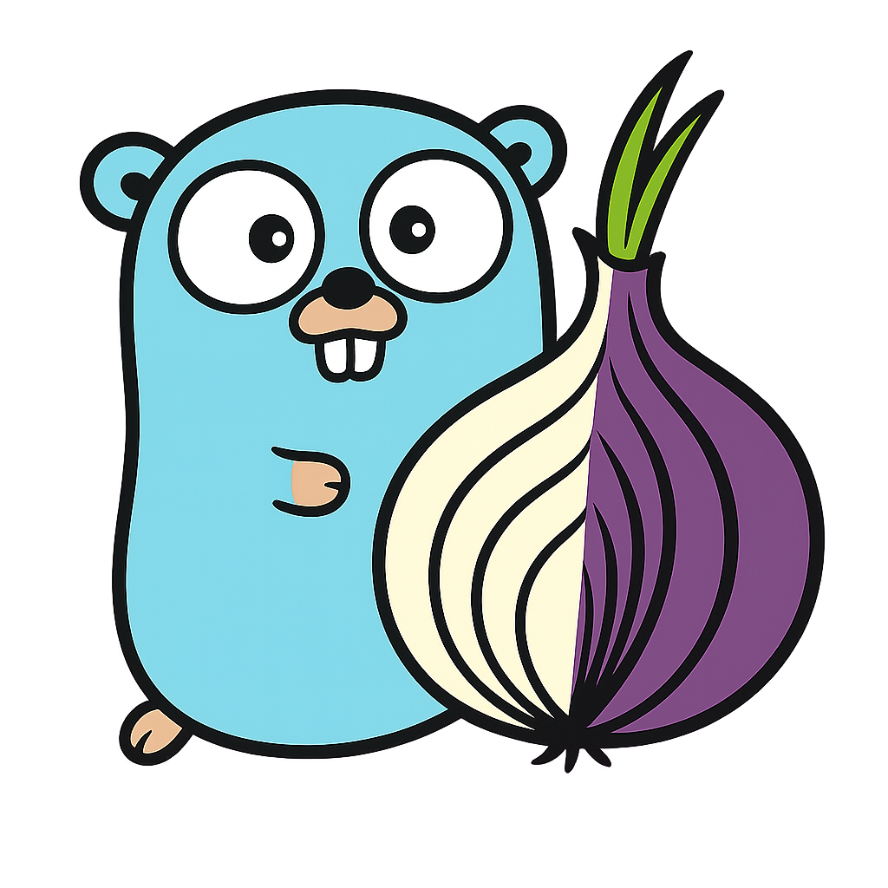

# 

***go-tor*** is a Go API for using and controlling Tor. It is based on [Bine](https://www.github.com/cretz/bine) but Tor is only staticaly embeded in to the binary.

Features:

* Full support for the Tor controller API
* Support for `net.Conn` and `net.Listen` style APIs

Supported are:
- Linux x86-64
- Linux aarch64
- Windows x86-64

## Example

It is really easy to create an onion service.

```go
package main

import (
	"context"
	"fmt"
	"log"
	"net/http"
	"time"

	"github.com/chainpilots/go-tor/tor"
)

func main() {
	// Start tor with default config (can set start conf's DebugWriter to os.Stdout for debug logs)
	fmt.Println("Starting and registering onion service, please wait a couple of minutes...")
	t, err := tor.Start(nil, nil)
	if err != nil {
		log.Panicf("Unable to start Tor: %v", err)
	}
	defer t.Close()
	// Wait at most a few minutes to publish the service
	listenCtx, listenCancel := context.WithTimeout(context.Background(), 3*time.Minute)
	defer listenCancel()
	// Create a v3 onion service to listen on any port but show as 80
	onion, err := t.Listen(listenCtx, &tor.ListenConf{RemotePorts: []int{80}})
	if err != nil {
		log.Panicf("Unable to create onion service: %v", err)
	}
	defer onion.Close()
	fmt.Printf("Open Tor browser and navigate to http://%v.onion\n", onion.ID)
	fmt.Println("Press enter to exit")
	// Serve the current folder from HTTP
	errCh := make(chan error, 1)
	go func() { errCh <- http.Serve(onion, http.FileServer(http.Dir("."))) }()
	// End when enter is pressed
	go func() {
		fmt.Scanln()
		errCh <- nil
	}()
	if err = <-errCh; err != nil {
		log.Panicf("Failed serving: %v", err)
	}
}
```

If in `main.go` it can simply be run with `go run main.go`.

In non-Windows environments, the `UseEmbeddedControlConn` field in `StartConf` can be set to `true` to use an embedded socket that does not open a control port.
